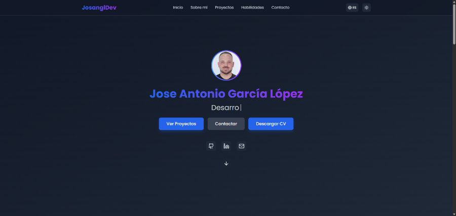

# 💼 Portfolio Profesional — José Antonio García López

Este proyecto es un portfolio web moderno y responsive para mostrar tus proyectos, experiencia y habilidades, desarrollado con **React**, **Vite** y **TailwindCSS**.

[🌐 Ver sitio en producción](AQUÍ_TU_ENLACE_PORTFOLIO)

---

## 📸 Capturas de pantalla



---

## 🗂️ Estructura y funcionalidades

- **Presentación personal:** Sección principal con tu nombre, foto y breve introducción.
- **Proyectos destacados:** Galería de proyectos con enlaces a GitHub y, si existe, a la demo en vivo.
- **Habilidades técnicas:** Visualización de tus skills principales.
- **Formulario de contacto:** Permite a los visitantes enviarte mensajes directamente.
- **Diseño moderno:** UI limpia, profesional y totalmente responsive.
- **Animaciones suaves:** Interacciones visuales y transiciones atractivas.
- **Accesibilidad:** Navegación por teclado y etiquetas ARIA.

---

## 🚀 Tecnologías y herramientas

- **React 19** — Biblioteca de JavaScript para interfaces de usuario
- **Vite** — Bundler ultrarrápido para desarrollo moderno
- **TailwindCSS** — Framework de utilidades CSS para diseño ágil
- **ESLint** — Linter para mantener calidad del código
- **PostCSS** — Procesador de CSS para optimización
- **TypeScript** — Tipado estático para mayor robustez

---

## 🧠 Metodología y optimización

- **Hooks personalizados:** Gestión de tema (oscuro/claro) e idioma.
- **Componentes reutilizables:** Arquitectura modular y mantenible.
- **Optimización de rendimiento:** Renderizado eficiente y separación de lógica.
- **Accesibilidad:** ARIA labels y navegación por teclado.
- **Código limpio:** ESLint configurado y sin duplicados.

---

## 📁 Organización del proyecto

```
├── index.html
├── src/
│   ├── main.tsx              # Punto de entrada de la aplicación
│   ├── App.tsx               # Componente principal
│   ├── index.css             # Tailwind + estilos globales
│   ├── i18n.ts               # Configuración de internacionalización
│   ├── components/           # Componentes reutilizables (Hero, Header, Footer, etc.)
│   ├── data/                 # Datos de proyectos, skills y experiencia
│   ├── hooks/                # Hooks personalizados (tema, idioma)
│   ├── types/                # Tipos TypeScript globales
│   └── assets/               # Recursos estáticos (imágenes, iconos)
├── public/                   # Archivos públicos (favicon, manifest, etc.)
├── docs/                     # Documentación y capturas de pantalla
├── vite.config.ts            # Configuración de Vite
├── tailwind.config.js        # Configuración de Tailwind
├── postcss.config.js         # Configuración de PostCSS
├── eslint.config.js          # Configuración de ESLint
└── package.json
```

---

## 🛠️ Instalación y uso local

1. **Clona el repositorio:**
   ```bash
   git clone https://github.com/josangldev/portfolio.git
   cd portfolio
   ```

2. **Instala las dependencias:**
   ```bash
   npm install
   ```

3. **Inicia el servidor de desarrollo:**
   ```bash
   npm run dev
   ```
   Abre [http://localhost:5173](http://localhost:5173) en tu navegador.

4. **Ejecuta el linter:**
   ```bash
   npm run lint
   ```

---

## Build y despliegue

1. **Genera la versión de producción:**
   ```bash
   npm run build
   ```
   Los archivos listos para producción estarán en la carpeta `dist/`.

2. **Vista previa de producción:**
   ```bash
   npm run preview
   ```

3. **Despliegue en Vercel:**
   - Sube el repositorio a GitHub
   - Conecta el repo en [Vercel](https://vercel.com/)
   - Configura el directorio de salida como `dist`
   - ¡Listo! Vercel detecta automáticamente Vite y realiza el despliegue


---

## 🔧 Scripts disponibles

- `npm run dev` - Inicia el servidor de desarrollo
- `npm run build` - Genera la versión de producción
- `npm run preview` - Vista previa de la versión de producción
- `npm run lint` - Ejecuta el linter para verificar código

---

## 🤖 Uso de Inteligencia Artificial

El desarrollo del proyecto ha incorporado el uso de **Inteligencia Artificial** como apoyo para:
- Asistente personal.
- Automatización de tareas repetitivas.
- Refactoring y optimización de código.

---

## 👤 Autor

**José Antonio García López**  
Desarrollador Frontend junior.

- [GitHub](https://github.com/josangldev)
- [LinkedIn](https://www.linkedin.com/in/jos%C3%A9-antonio-garc%C3%ADa-l%C3%B3pez-4ba263347/)

---

## 📄 Licencia

MIT

---

## 🤝 Contribuciones

Las contribuciones son bienvenidas. Por favor, abre un issue o un pull request para sugerir mejoras o reportar bugs.
